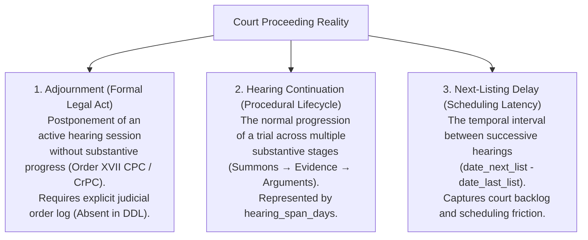

# JDIS Methodological Note & Scope Assessment: Hearing Continuation & Next-Listing Delay

**Project**: Judicial Delay Intelligence System (JDIS)  
**Role**: Tanmay — Data Engineer & Data Architect  
**Status**: Approved by Human Review — Research Reframing Adopted  
**Operational Target**: **Hearing Continuation & Next-Listing Delay Prediction**

---

## 1. Executive Summary & Approved Research Reframing

Following the formal human review of the Dataset Audit, the proposed "Adjournment Prediction" module has been **officially reframed and renamed** across all JDIS codebases, research papers, and API specifications to:

**"Hearing Continuation & Next-Listing Delay Prediction"**

This change ensures scientific honesty and strict adherence to IEEE peer-review standards, as the DDL e-Courts dataset does not contain explicit, granular hearing-by-hearing adjournment orders.

---

## 2. Critical Methodological Distinctions

To prevent conceptual confusion, the JDIS data architecture enforces explicit legal and statistical definitions:

1. **Adjournment (Formal Judicial Postponement)**:
   - *Definition*: A formal judicial order deferring a scheduled proceeding to a future date, often due to absent counsel, pending witness summons, or procedural unreadiness.
   - *Data Constraint*: The DDL public dataset aggregates case milestones and **does not provide session-by-session proceeding logs**. Claiming to predict "adjournments" would be scientifically invalid.
2. **Hearing Continuation (Trial Stage Progression)**:
   - *Definition*: In Indian lower courts, multiple hearings are a mandatory feature of trial procedure. Cases naturally continue across multiple dates to record evidence and hear arguments.
   - *Metric*: $\text{hearing\_span\_days} = \text{date\_last\_list} - \text{date\_first\_list}$ (Median: 356.0 days).
3. **Next-Listing Delay (Scheduling Latency)**:
   - *Definition*: The actual calendar gap between the most recent court appearance and the next scheduled appearance date.
   - *Metric*: $\text{next\_listing\_gap\_days} = \text{date\_next\_list} - \text{date\_last\_list}$.

---

## 3. Approved Prediction Target & Prediction Point Protocol

### 3.1 Prediction Point Definition
The Next-Listing Delay model operates at a specific observation point during the case lifecycle:
- **Prediction Point**: The date of the current/last hearing ($\text{date\_last\_list}$).
- **Target Variable**: $\text{next\_listing\_gap\_days} = \text{date\_next\_list} - \text{date\_last\_list}$.
- **Binary Continuation Risk**: $\mathbb{I}(\text{hearing\_span\_days} > 365.25\text{ days})$.

### 3.2 Strict Leakage Prohibition
- When predicting $\text{next\_listing\_gap\_days}$, the future date $\text{date\_next\_list}$ is the target and **MUST NEVER be used as an input feature**.
- Input features are restricted strictly to facts known as of $\text{date\_last\_list}$ (e.g. days elapsed since filing, court congestion, purpose of the current hearing stage).

---

## 4. Implementation in JDIS Codebase

1. **Feature Dataset**: Stored in `data/features/hearing_features.parquet` (Dataset C).
2. **API Endpoint**: `POST /api/predict/hearing-delay` (Backend: Namdeo).
3. **UI Display**: "Estimated Days to Next Listing & Trial Continuation Risk" (Frontend: Shukla).
4. **IEEE Paper Section**: Documented under *"Section III.B: Hearing Continuation and Next-Listing Latency Modeling"*.
