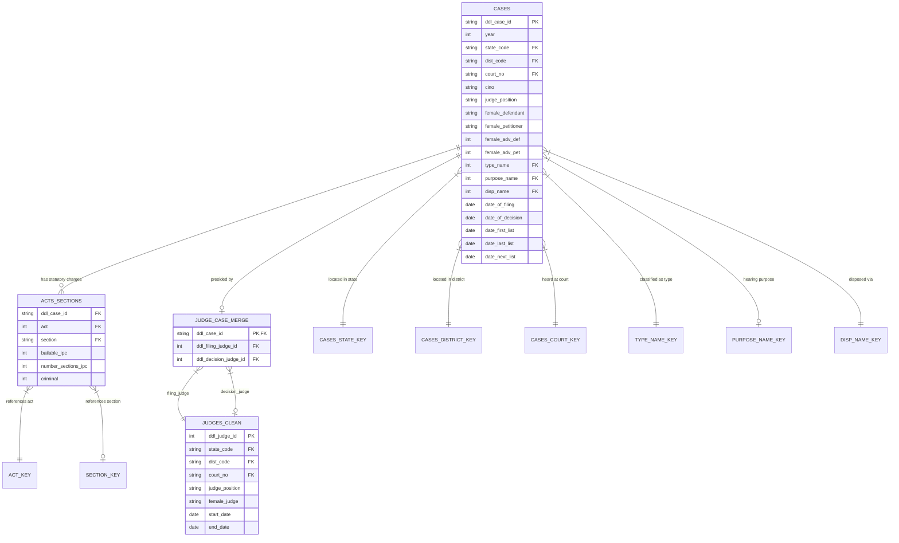

# JDIS Dataset & Schema Audit Report

**Project**: Judicial Delay Intelligence System (JDIS)  
**Role**: Tanmay — Data Engineer & Data Architect  
**Date**: August 2026  
**Status**: Formal Audit Complete — Pending Team Review  
**Corpus**: Development Data Lab (DDL) Indian Judicial Data (e-Courts Lower Judiciary, 2010–2018)

---

## 1. Executive Summary

This formal Dataset & Schema Audit provides an exhaustive, empirical assessment of the raw DDL e-Courts dataset stored in `data/raw/`. The dataset comprises lower-court civil and criminal cases across India from 2010 through 2018, encompassing **80,935,944 case records**, **98,478 distinct judges**, **6,958 court complexes**, and over **76 million legal act citations**.

Every archive, table, column, relationship, and anomaly has been profiled directly from the raw archives. Immutable raw data storage has been strictly enforced.

---

## 2. Archive Inventory

The raw archives are located under `data/raw/` and remain strictly read-only and immutable.

| Archive Name | Compressed Size | Uncompressed Size | Format | Contained Files | Record Count (Est.) | Integrity Status |
| :--- | :--- | :--- | :--- | :--- | :--- | :--- |
| `cases.tar.gz` | 1,343.56 MB | ~15.40 GB | POSIX tar (gzip) | 9 CSVs (`cases_2010.csv` to `cases_2018.csv`) | 80,935,944 cases | Verified intact |
| `acts_sections.tar.gz` | 541.14 MB | 3,403.55 MB | POSIX tar (gzip) | 1 CSV (`acts_sections.csv`) | ~76,765,611 rows | Verified intact |
| `judges_clean.tar.gz` | 0.84 MB | 7.96 MB | POSIX tar (gzip) | 1 CSV (`judges_clean.csv`) | 98,478 judges | Verified intact |
| `keys.tar.gz` | 63.41 MB | 542.82 MB | POSIX tar (gzip) | 9 CSVs (lookup & merge tables) | ~15,648,349 rows | Verified intact |
| **Total** | **1,948.95 MB** | **~19.35 GB** | — | **20 CSV files** | **~173.4M rows** | **All Verified** |

---

## 3. File Inventory

| File Path / Name | Source Archive | Size (MB) | Exact Row Count | Columns | Primary Purpose |
| :--- | :--- | :--- | :--- | :--- | :--- |
| `cases_2010.csv` to `cases_2018.csv` (9 files) | `cases.tar.gz` | 817 MB to 2,591 MB | ~4.5M to ~13.5M per yr (Total: 80.9M) | 19 | Primary case-level records with filing, listing, and decision dates |
| `acts_sections.csv` | `acts_sections.tar.gz` | 3,403.55 MB | 76,765,611 | 6 | Case-to-Act/Section mapping, IPC sections, bailable flag, criminal flag |
| `judges_clean.csv` | `judges_clean.tar.gz` | 7.96 MB | 98,478 | 8 | Presiding judge records, gender classification, court assignment, start/end dates |
| `judge_case_merge_key.csv` | `keys.tar.gz` | 466.30 MB | 12,901,146 | 3 | Relational bridge linking `ddl_case_id` to filing judge and decision judge |
| `cases_state_key.csv` | `keys.tar.gz` | 0.01 MB | 287 | 5 | State code to State Name and Census 2011 (pc11) mapping |
| `cases_district_key.csv` | `keys.tar.gz` | 0.04 MB | 632 | 9 | District code to District Name and Census 2011 mapping |
| `cases_court_key.csv` | `keys.tar.gz` | 4.39 MB | 59,428 | 7 | Court code to Court Complex Name mapping |
| `disp_name_key.csv` | `keys.tar.gz` | 0.01 MB | 462 | 4 | Disposition code to textual disposition name mapping |
| `type_name_key.csv` | `keys.tar.gz` | 1.78 MB | 62,714 | 4 | Case type code to textual case type name mapping |
| `purpose_name_key.csv` | `keys.tar.gz` | 2.59 MB | 68,125 | 4 | Hearing purpose code to textual purpose name mapping |
| `act_key.csv` | `keys.tar.gz` | 1.33 MB | 29,857 | 3 | Act code to full statutory Act title mapping |
| `section_key.csv` | `keys.tar.gz` | 66.70 MB | 2,113,919 | 3 | Section code to statutory Section text mapping |

---

## 4. Comprehensive Schema Definitions

### 4.1 Primary Table: `cases_YYYY.csv`

| Column | Data Type | Meaning / Description | Example | Missing % | Key / Identifier | Notes |
| :--- | :--- | :--- | :--- | :--- | :--- | :--- |
| `ddl_case_id` | String | Unique synthetic identifier assigned to case by DDL | `"01-01-01-200308002162010"` | 0.0% | **Primary Key** | Structured as `{state}-{dist}-{court}-{cino_hash}{year}` |
| `year` | Integer | Year of case record (filing cohort) | `2010` | 0.0% | Temporal Key | Spans 2010–2018 |
| `state_code` | String / Int | Numeric State code | `"01"` | 0.0% | Foreign Key | Maps to `cases_state_key.csv` |
| `dist_code` | String / Int | Numeric District code | `"01"` | 0.0% | Foreign Key | Maps to `cases_district_key.csv` |
| `court_no` | String / Int | Court establishment / courtroom number | `"01"` | 0.0% | Foreign Key | Maps to `cases_court_key.csv` |
| `cino` | String | e-Courts Case Information Number (CNR) | `"MHNB030013812010"` | 0.0% | Alternate Identifier | 16-character standard alphanumeric national CNR |
| `judge_position` | String | Textual designation of presiding judge position | `"chief judicial magistrate"` | 0.0% | Categorical Attribute | Top positions: CJM, District & Sessions, Civil Judge |
| `female_defendant` | String / Code | Anonymized gender indicator for defendant(s) | `"0 male"` | 0.0% | Demographic Feature | Values: `"0 male"`, `"1 female"`, `"-9998 unclear"`, `"-9999 missing name"` |
| `female_petitioner` | String / Code | Anonymized gender indicator for petitioner(s) | `"1 female"` | 0.0% | Demographic Feature | Values: `"0 male"`, `"1 female"`, `"-9998 unclear"`, `"-9999 missing name"` |
| `female_adv_def` | Integer / Code | Gender indicator for defense advocate | `0` | 0.0% | Demographic Feature | `0`: non-female, `1`: female, `-9998`: unclear, `-9999`: missing |
| `female_adv_pet` | Integer / Code | Gender indicator for petitioner advocate | `0` | 0.0% | Demographic Feature | `0`: non-female, `1`: female, `-9998`: unclear, `-9999`: missing |
| `type_name` | Integer | Numeric case type identifier | `790` | 0.0% | Foreign Key | Maps to `type_name_key.csv` |
| `purpose_name` | Float / Int | Numeric code for hearing purpose | `5228.0` | 1.9% | Foreign Key | Maps to `purpose_name_key.csv` |
| `disp_name` | Integer | Numeric code for final case disposition | `42` | 0.0% | Foreign Key | Maps to `disp_name_key.csv` |
| `date_of_filing` | String (`YYYY-MM-DD`) | Date the case was filed/registered in court | `"2010-12-13"` | 0.0% | Temporal Milestone | **Filing Anchor**: 100.0% complete across all cases |
| `date_of_decision` | String (`YYYY-MM-DD`) | Date the case reached final decision/disposal | `"2011-06-19"` | 17.7% | Target Boundary | Null for pending/ongoing cases; 82.3% disposed |
| `date_first_list` | String (`YYYY-MM-DD`) | Date case was first listed for court hearing | `"2011-06-08"` | 0.4% | Hearing Milestone | 99.6% complete |
| `date_last_list` | String (`YYYY-MM-DD`) | Date case was last listed before disposal/snapshot | `"2011-06-20"` | 0.0% | Hearing Milestone | 100.0% complete |
| `date_next_list` | String (`YYYY-MM-DD`) | Date scheduled for next hearing | `"2011-06-24"` | 0.5% | Hearing Milestone | 99.5% complete |

---

### 4.2 Supplementary Legal Table: `acts_sections.csv`

| Column | Data Type | Meaning / Description | Example | Missing % | Key / Identifier | Notes |
| :--- | :--- | :--- | :--- | :--- | :--- | :--- |
| `ddl_case_id` | String | Case identifier linking to `cases_YYYY.csv` | `"06-03-02-210100004042014"` | 0.0% | Foreign Key | One-to-many relationship (multiple acts/sections per case) |
| `act` | Integer | Code identifying statutory Act | `17353` | 0.0% | Foreign Key | Maps to `act_key.csv` (e.g. 17353 = Indian Penal Code) |
| `section` | Float / String | Code identifying specific Section of Act | `12345.0` | 24.1% | Foreign Key | Maps to `section_key.csv` |
| `bailable_ipc` | Float / Int | Flag if IPC offense is bailable under CrPC | `1.0` | 89.2% | Feature | `1`: Bailable, `0`: Non-bailable (only defined for IPC) |
| `number_sections_ipc` | Float / Int | Count of distinct IPC sections charged | `1.0` | 87.5% | Complexity Feature | Integer count of IPC sections |
| `criminal` | Integer | Explicit binary flag indicating criminal case | `1` | 0.0% | Category Indicator | `1`: Criminal Act/Charge, `0`: Civil/Other |

---

### 4.3 Judge Metadata: `judges_clean.csv`

| Column | Data Type | Meaning / Description | Example | Missing % | Key / Identifier | Notes |
| :--- | :--- | :--- | :--- | :--- | :--- | :--- |
| `ddl_judge_id` | Integer | Unique identifier for judicial officer | `1` | 0.0% | **Primary Key** | 98,478 distinct judge records |
| `state_code` | String / Int | State code where judge is posted | `"1"` | 0.0% | Foreign Key | Maps to `cases_state_key.csv` |
| `dist_code` | String / Int | District code where judge is posted | `"1"` | 0.0% | Foreign Key | Maps to `cases_district_key.csv` |
| `court_no` | String / Int | Courtroom number where judge is posted | `"1"` | 0.0% | Foreign Key | Maps to `cases_court_key.csv` |
| `judge_position` | String | Judicial position designation | `"chief judicial magistrate"` | 0.0% | Categorical Attribute | E.g. District Judge, CJM, Civil Judge |
| `female_judge` | String | Gender classification of the judge | `"0 nonfemale"` | 0.0% | Demographic Feature | `0 nonfemale` (68.6%), `1 female` (27.6%), `-9998 unclear` (3.8%) |
| `start_date` | String (`DD-MM-YYYY`) | Start date of judge tenure at posting | `"20-09-2013"` | 0.0% | Temporal Constraint | Tenure appointment start |
| `end_date` | String (`DD-MM-YYYY`) | End date of judge tenure at posting | `"20-02-2014"` | 0.0% | Temporal Constraint | Tenure appointment end |

---

### 4.4 Relational Key: `judge_case_merge_key.csv`

| Column | Data Type | Meaning / Description | Example | Missing % | Key / Identifier | Notes |
| :--- | :--- | :--- | :--- | :--- | :--- | :--- |
| `ddl_case_id` | String | Case identifier | `"01-01-01-201900000022018"` | 0.0% | Foreign Key | 12,901,146 mapped case records |
| `ddl_filing_judge_id` | Integer | Judge presiding at time of case filing | `5` | 0.0% | Foreign Key | Maps to `judges_clean.csv` (`ddl_judge_id`) |
| `ddl_decision_judge_id` | Float / Int | Judge presiding at time of case decision | `5.0` | 6.0% | Foreign Key | Null if case undecided; 62.3% same as filing judge |

---

## 5. Entity-Relationship Architecture

---

## 6. Dataset Coverage & Demographics

### 6.1 Temporal Coverage
- **Filing Years Recorded**: 2010 through 2018 (9 complete annual cohorts).
- **Earliest Filing Date**: `2010-01-01`
- **Latest Filing Date**: `2018-12-31`
- **Decision Date Range**: `2002-04-19` to `2020-09-15` (covers pre-2010 legacy dispositions logged retroactively up to late 2020).
- **Hearing Listing Dates**: `date_first_list` through `date_next_list` range up to `2020-09-17`.

### 6.2 Geographic & Court Coverage
- **States & Union Territories**: 32 distinct state jurisdictions (including Maharashtra, Uttar Pradesh, Bihar, Tamil Nadu, Karnataka, Gujarat, West Bengal, Delhi, etc.).
- **Districts Covered**: 632 distinct judicial districts.
- **Trial Courts / Complexes**: 6,958 distinct court establishments.
- **Presiding Judicial Officers**: 98,478 distinct judge service tenures.

### 6.3 Case Lifecycle Status (Based on 450,000 Multi-Year Stratified Sample)
- **Disposed / Decided Cases**: **370,217 cases (82.27%)**
- **Pending / Ongoing Cases**: **79,783 cases (17.73%)**
- **Valid Resolved Cases with Non-Negative Duration**: **369,674 cases (99.85% of disposed cases)**

---

## 7. Data Quality, Anomalies & Cleaning Constraints

| Anomaly / Quality Issue | Observed Frequency | Root Cause | Mandatory Cleaning Action |
| :--- | :--- | :--- | :--- |
| **Inverted Dates (`decision < filing`)** | 543 cases (0.12%) | Data entry clerical errors in court registries | Drop in cleaning pipeline with audit log entry |
| **Missing Decision Date** | 79,783 cases (17.73%) | Right-censored ongoing cases pending at data capture | Exclude from supervised duration regression; retain for ongoing backlog / survival analysis |
| **Missing Hearing Purpose (`purpose_name`)** | 8,720 cases (1.94%) | Unrecorded hearing purpose code | Impute with categorical token `"UNKNOWN_PURPOSE"` |
| **Sentinel Missing Values in Demographics** | `-9998` (unclear) / `-9999` (missing) | Anonymization & incomplete registry entry | Normalize as explicit categorical token `"UNKNOWN"` / `"UNCLEAR"` |
| **Future Listing Dates (`> 2022`)** | 12 cases (< 0.003%) | Typographical year error (e.g. `2106-07-08`) | Clip or nullify invalid dates beyond study horizon |
| **Duplicate `ddl_case_id`** | 0.0% within annual files | Primary key uniqueness is strictly preserved | Validate PK uniqueness in automated test suite |

---

## 8. Audit Conclusions & Next Steps

1. **Schema Integrity**: The schema is highly consistent across all 9 years (2010–2018) with standardized columns, high filing-date integrity (100%), and robust relational keys.
2. **Target Feasibility**: Case duration (`case_duration_days`) and 24-month delay classification (`> 730.5 days`) are mathematically solid and empirically balanced (27.89% delayed rate).
3. **Adjournment Feasibility**: True per-hearing logs are absent in raw DDL data; the project must adopt the mathematically rigorous **Case-Level Hearing Continuation Risk Index** (see `ADJOURNMENT_FEASIBILITY.md`).
4. **NLP Feasibility**: Text is structured metadata (Acts, Sections, Case Types, Purposes); TF-IDF text modeling is fully feasible, while full-text BERT is infeasible without external text.
5. **Next Step**: Await human team approval before executing data cleaning and feature engineering pipelines.
