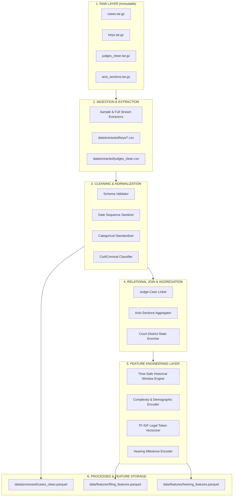

# JDIS Data Architecture & Pipeline Design

**Project**: Judicial Delay Intelligence System (JDIS)  
**Role**: Tanmay — Data Engineer & Data Architect  
**Version**: 1.0.0  
**Date**: August 2026  

---

## 1. Pipeline Architecture Overview

The JDIS data pipeline is designed for **full reproducibility**, **zero source modification**, and **high computational efficiency** using multi-stage modular processing.



---

## 2. Pipeline Execution Stages

### Stage 1: Ingestion & Extraction (`src/data/ingest.py`)
- Reads raw `.tar.gz` archives in streaming chunks without loading massive multi-gigabyte archives into memory.
- Extracts lookup tables (`keys/*.csv` and `judges_clean.csv`) into `data/extracted/`.
- Extracts representative stratified subsets (Pilot Stage A: 50k–100k, Scaled Stage B: 500k–1M, Full Stage C: 2M–5M) into `data/extracted/`.

### Stage 2: Data Cleaning & Normalization (`src/data/clean.py`)
1. **Column Name Normalization**: Strip whitespaces, enforce lowercase snake_case standard.
2. **Date Parsing & Verification**: Convert `date_of_filing`, `date_of_decision`, `date_first_list`, `date_last_list`, `date_next_list` to ISO dates.
3. **Invalid Timeline Removal**: Filter records where `date_of_decision < date_of_filing` or `date_first_list < date_of_filing - 30 days` (data entry typos).
4. **Demographic Normalization**: Map sentinel values `-9998` (unclear), `-9999` (missing) to standard categorical levels.
5. **Civil vs. Criminal Categorization**: Apply deterministic mapping based on `type_name_key` and `acts_sections` flags.
6. **Parquet Export**: Save intermediate clean table to `data/processed/cases_clean.parquet`.

### Stage 3: Relational Joining & Aggregation (`src/data/join.py`)
- Join `judge_case_merge_key.csv` to map `ddl_filing_judge_id` and judge appointment metadata from `judges_clean.csv`.
- Aggregate `acts_sections.csv` at case level to generate:
  - `statutory_act_count`: Count of unique acts.
  - `ipc_section_count`: Count of IPC sections.
  - `bailable_ipc_flag`: Binary indicator of bailable offenses.
  - `primary_act_code`: Dominant statutory Act.
- Join court, district, and state names from lookup keys.

### Stage 4: Feature Engineering (`src/features/build_features.py`)
- **Filing-Time Features**:
  - Calendar/Cyclic features (`filing_month`, `filing_day_of_week`, `filing_quarter`).
  - Legal complexity & demographic flags.
  - TF-IDF legal token representations (fit strictly on training split).
- **Time-Safe Historical Statistics**:
  - `court_prior_delay_rate` & `court_prior_active_backlog` (computed using expanding historical windows as of case filing date).
  - `judge_prior_delay_rate` & `judge_prior_cases_decided`.
- **Hearing-Stage Features**:
  - `filing_to_first_list_days`, `hearing_span_days`, `next_listing_gap_days`, `purpose_stage_clean`.
- **Target Matrices**:
  - Supervised regression matrix: `case_duration_days`.
  - Supervised classification matrix: `delay_24m` (primary), `delay_12m`, `delay_36m` (sensitivity).
  - Hearing continuation matrix: `hearing_delay_risk`.

---

## 3. Directory Layout & Module Structure

```text
e:/JDIS/
├── data/
│   ├── raw/                  # Immutable original archives (cases, keys, judges, acts)
│   ├── extracted/            # Extracted key tables and multi-year sample CSVs
│   ├── processed/            # Cleaned, validated relational parquet tables
│   └── features/             # Model-ready feature matrices (filing_features.parquet, etc.)
├── docs/
│   └── data/                 # All data engineering documentation and audits
├── src/
│   ├── data/
│   │   ├── __init__.py
│   │   ├── ingest.py         # Streaming ingestion and decompression
│   │   ├── clean.py          # Cleaning, date validation, and normalization
│   │   ├── join.py           # Relational key resolution and legal aggregation
│   │   └── validate.py       # Automated data quality and schema validation
│   └── features/
│       ├── __init__.py
│       ├── build_features.py # Feature engineering pipeline
│       ├── historical.py     # Time-safe expanding window calculation engine
│       └── text_features.py  # TF-IDF token vectorizer
└── tests/
    └── data/
        ├── test_schemas.py    # Schema integrity and type validation tests
        ├── test_cleaning.py   # Test date ordering and duplicate rules
        └── test_leakage.py    # Automated test verifying zero temporal leakage
```

---

## 4. Staged Scaling Plan

| Stage | Sample Size | Primary Target | Compute Requirement | Execution Time | Purpose |
| :--- | :--- | :--- | :--- | :--- | :--- |
| **Stage A** | 100,000 cases | Rapid validation | < 4 GB RAM | ~30 seconds | Verify end-to-end pipeline, schema contracts, and baseline models |
| **Stage B** | 500,000 cases | Robust benchmark | < 8 GB RAM | ~2 minutes | Hyperparameter tuning, model comparison, ablation studies |
| **Stage C** | 2,000,000 to 5,000,000 | Final Publication Models | ~16 GB RAM | ~10 minutes | Final IEEE paper results, SHAP XAI calculations, sensitivity analysis |
