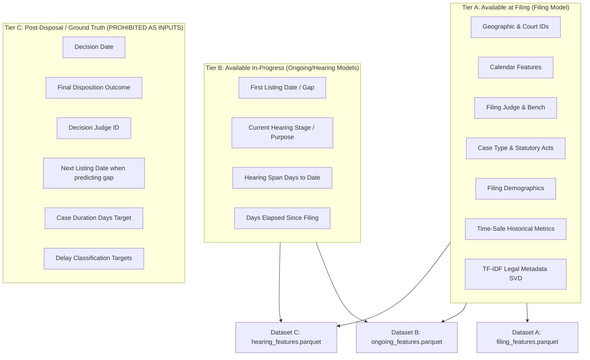

# JDIS Feature Leakage Audit & 3-Tier Time-Safety Classification

**Project**: Judicial Delay Intelligence System (JDIS)  
**Role**: Tanmay — Data Engineer & Data Architect  
**Version**: 2.0.0 (Approved Post-Review Specification)  
**Date**: August 2026  

---

## 1. Executive Summary & 3-Tier Classification Protocol

To guarantee zero look-ahead bias and ensure absolute scientific validity for the IEEE research paper, all features across the JDIS platform are strictly partitioned into three temporal tiers according to their prediction point availability.

---

## 2. Comprehensive 3-Tier Feature Classification

### Tier A — Available at Filing Stage
These features are known and permanently recorded in the court registry at the moment a case is filed ($T_{\text{filing}}$). They are permitted across **all JDIS models**.

| Column / Feature Name | Source Field(s) | Description | Leakage Status | Permitted In |
| :--- | :--- | :--- | :--- | :--- |
| `state_code` / `state_str` | `cases_YYYY.csv` / `cases_state_key.csv` | State jurisdiction name and code | **Safe at Filing** | Datasets A, B, C |
| `dist_code` / `district_str` | `cases_YYYY.csv` / `cases_district_key.csv` | District jurisdiction name and code | **Safe at Filing** | Datasets A, B, C |
| `court_no` / `court_str` | `cases_YYYY.csv` / `cases_court_key.csv` | Court complex establishment | **Safe at Filing** | Datasets A, B, C |
| `filing_year`, `month`, `day_of_week`, `quarter` | `date_of_filing` | Temporal calendar anchors | **Safe at Filing** | Datasets A, B, C |
| `judge_position_clean` | `judge_position` | Presiding bench position (CJM, District, etc.) | **Safe at Filing** | Datasets A, B, C |
| `ddl_filing_judge_id` | `judge_case_merge_key.csv` | Judge assigned at case registration | **Safe at Filing** | Datasets A, B, C |
| `judge_gender` | `judges_clean.csv` | Presiding judge gender flag | **Safe at Filing** | Datasets A, B, C |
| `case_type_str` / `type_name` | `type_name_key.csv` | Initial case category description | **Safe at Filing** | Datasets A, B, C |
| `case_category` / `is_criminal_code` | 4-category classification | High-Confidence Criminal / Civil / Other | **Safe at Filing** | Datasets A, B, C |
| `statutory_act_count` | `acts_sections.csv` | Count of unique statutory Acts charged | **Safe at Filing** | Datasets A, B, C |
| `ipc_section_count` | `acts_sections.csv` | Count of IPC sections charged | **Safe at Filing** | Datasets A, B, C |
| `bailable_ipc_flag` | `acts_sections.csv` | Bailable offense indicator under CrPC | **Safe at Filing** | Datasets A, B, C |
| `primary_act_id` | `acts_sections.csv` | Dominant legal Act ID | **Safe at Filing** | Datasets A, B, C |
| `female_defendant_clean` | `cases_YYYY.csv` | Defendant gender indicator at filing | **Safe at Filing** | Datasets A, B, C |
| `female_petitioner_clean` | `cases_YYYY.csv` | Petitioner gender indicator at filing | **Safe at Filing** | Datasets A, B, C |
| `female_adv_def_clean` | `cases_YYYY.csv` | Defense advocate gender flag | **Safe at Filing** | Datasets A, B, C |
| `female_adv_pet_clean` | `cases_YYYY.csv` | Petitioner advocate gender flag | **Safe at Filing** | Datasets A, B, C |
| `court_prior_delay_rate` | Expanding window ($< T_{\text{filing}}$) | Smoothed prior court delay rate | **Time-Safe Historical** | Datasets A, B, C |
| `court_prior_avg_duration` | Expanding window ($< T_{\text{filing}}$) | Historical court mean duration (days) | **Time-Safe Historical** | Datasets A, B, C |
| `court_prior_active_backlog` | Expanding window ($< T_{\text{filing}}$) | Active undecided filings in court at $T_{\text{filing}}$ | **Time-Safe Historical** | Datasets A, B, C |
| `casetype_prior_delay_rate` | Expanding window ($< T_{\text{filing}}$) | Historical delay rate for case type | **Time-Safe Historical** | Datasets A, B, C |
| `judge_court_degree` | `judges_clean.csv` | Number of distinct courts judge presided over | **Graph Feature** | Datasets A, B, C |
| `judge_tenure_days` | `judges_clean.csv` | Total career tenure days of judge | **Graph Feature** | Datasets A, B, C |
| `court_judge_turnover_count` | `judges_clean.csv` | Number of judges assigned to court | **Graph Feature** | Datasets A, B, C |
| `tfidf_0` to `tfidf_49` | Fit strictly on Train (2010–2016) | Dense SVD components of legal tokens | **Time-Safe NLP** | Datasets A, B |

---

### Tier B — Available In-Progress (Ongoing & Hearing Stage Models Only)
These features become known only after the case has entered the courtroom schedule. **They MUST NOT be used in the initial Filing-Time Model (Dataset A).**

| Column / Feature Name | Source Field(s) | Description | Prediction Stage | Permitted In |
| :--- | :--- | :--- | :--- | :--- |
| `filing_to_first_list_days` | `date_first_list - date_of_filing` | Days elapsed before first hearing | First Listing Milestone | Dataset B Only |
| `days_since_filing_at_last_list` | `date_last_list - date_of_filing` | Total case age at most recent hearing | Active Hearing Milestone | Dataset C Only |
| `hearing_span_days` | `date_last_list - date_first_list` | Total active hearing duration to date | Active Hearing Milestone | Dataset C Only |
| `purpose_str` | `purpose_name_key.csv` | Procedural stage of active hearing | Active Hearing Milestone | Dataset C Only |

---

### Tier C — Post-Disposal Fields & Ground Truth Targets (STRICTLY PROHIBITED AS INPUTS)
These fields represent the outcome or target. **Using any of these as an input feature constitutes fatal scientific contamination.**

| Prohibited Column | Reason for Prohibition |
| :--- | :--- |
| `date_of_decision` / `date_of_decision_dt` | Future event (target timestamp) |
| `disp_name` / `disp_str` / `disp_name_s` | Post-disposal judgment outcome (e.g. *acquitted, convicted, dismissed*) |
| `ddl_decision_judge_id` | Presiding judge at final disposal (post-filing fact) |
| `date_next_list` / `date_next_list_dt` | Ground truth target for Next-Listing Delay Model |
| `case_duration_days` | Ground truth regression target |
| `delay_24m`, `delay_12m`, `delay_36m` | Ground truth binary classification targets |
| `next_listing_gap_days` | Ground truth next-listing regression target |
| `hearing_continuation_risk` | Ground truth next-listing classification target |

---

## 3. Separated Research Datasets

| Dataset | Parquet File Path | Permitted Feature Tiers | Primary Target | Modeling Purpose |
| :--- | :--- | :--- | :--- | :--- |
| **Dataset A** | `data/features/filing_features.parquet` | **Tier A Only** | `case_duration_days`, `delay_24m` | Filing-Stage Duration Regression & Delay Classification |
| **Dataset B** | `data/features/ongoing_features.parquet` | **Tier A + Tier B (First List)** | `case_duration_days`, `delay_24m` | Ongoing-Case Progression Model |
| **Dataset C** | `data/features/hearing_features.parquet` | **Tier A + Tier B (Last List)** | `next_listing_gap_days`, `hearing_continuation_risk` | Next-Listing Delay & Hearing Continuation Model |

---

## 4. Automated Leakage Prevention Verification

Automated regression tests in `tests/data/test_leakage.py` execute on every build to verify:
1. **Zero Tier C columns** exist in `filing_features.parquet` or `ongoing_features.parquet`.
2. **Zero `date_next_list`** columns exist in `hearing_features.parquet`.
3. **Zero look-ahead leakage** in historical expanding windows.
