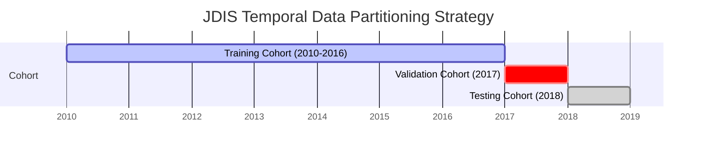

# JDIS Machine Learning Handoff Specification

**From**: Tanmay — Data Engineer & Data Architect  
**To**: Gaurav — AI & Research Lead  
**Cc**: Namdeo (Backend Lead), Shukla (Frontend Lead)  
**Date**: August 2026  
**Version**: 1.0.0 (Release Candidate)  
**Dataset Release**: DDL Judicial Data (2010–2018 Cohorts)  

---

## 1. Executive Summary & Purpose

This document constitutes the formal **Engineering Contract & Handoff Specification** from the Data Engineering workstream to the AI/ML workstream. 

It defines the exact dataset files Gaurav must load, the permitted input feature columns, target definitions, prohibited columns (leakage prevention), train/val/test split strategy, missing value handling, and baseline tensor schemas.

---

## 2. Dataset Locations & Storage Format

All processed and model-ready data are stored in column-oriented **Apache Parquet format** with Snappy compression for maximum loading speed and strict type enforcement.

| Dataset File | File Path | Record Count (Pilot / Scaled) | Purpose |
| :--- | :--- | :--- | :--- |
| **Clean Master Cases** | `data/processed/cases_clean.parquet` | ~450k (Pilot) / ~2.5M (Scaled) | Cleaned, normalized base table with resolved dates and keys |
| **Filing-Time Feature Matrix** | `data/features/filing_features.parquet` | ~370k resolved / ~450k all | Primary feature matrix for Filing-Stage Duration Regression & 24M Delay Classification |
| **Hearing-Stage Feature Matrix** | `data/features/hearing_features.parquet` | ~370k resolved | Active/In-progress feature matrix including hearing gap and procedural stage |
| **TF-IDF Vocabulary Artifact** | `data/features/tfidf_vectorizer.joblib` | 5,000 max features | Fitted vectorizer artifact (fit strictly on Training cohort) |

---

## 3. Data Split Protocol (Strict Temporal Split)

To ensure zero look-ahead bias and reflect real-world deployment on incoming cases, **random train-test splits (e.g. `train_test_split(shuffle=True)`) are STRICTLY PROHIBITED.**



- **Training Split**: Filing years **2010 through 2016** (~77% of corpus)
- **Validation Split**: Filing year **2017** (~11% of corpus) — Used for hyperparameter tuning & threshold calibration.
- **Testing Split**: Filing year **2018** (~12% of corpus) — Held-out test set for final IEEE paper evaluation.

---

## 4. Column Classification for Model Development

### 4.1 Permitted Model Input Columns (Filing Stage)
```python
FILING_FEATURE_COLUMNS = [
    # Geographic & Court Identifiers
    "state_code", "dist_code", "court_no",
    
    # Temporal & Calendar Features
    "filing_year", "filing_month", "filing_day_of_week", "filing_quarter",
    
    # Bench & Judge Position
    "judge_position_clean", "ddl_filing_judge_id",
    
    # Case Category & Statutory Complexity
    "is_criminal", "case_type_code", "statutory_act_count", 
    "ipc_section_count", "bailable_ipc_flag", "primary_act_code",
    
    # Demographics
    "female_petitioner_flag", "female_defendant_flag",
    "female_adv_pet_flag", "female_adv_def_flag",
    
    # Time-Safe Historical Court & Judge Context
    "court_prior_delay_rate", "court_prior_avg_duration", "court_prior_active_backlog",
    "judge_prior_delay_rate", "judge_prior_cases_decided", "casetype_prior_delay_rate",
    
    # NLP Components (Top 50 SVD features from TF-IDF)
    "tfidf_0", "tfidf_1", "tfidf_2", ..., "tfidf_49"
]
```

### 4.2 Supervised Target Columns
```python
TARGET_COLUMNS = {
    "regression_duration": "case_duration_days",       # Float: Days from filing to decision
    "binary_delay_24m":    "delay_24m",                # Binary (0/1): duration > 730.5 days (Primary)
    "binary_delay_12m":    "delay_12m",                # Binary (0/1): duration > 365.25 days (Sensitivity)
    "binary_delay_36m":    "delay_36m",                # Binary (0/1): duration > 1095.75 days (Sensitivity)
    "hearing_delay_risk":  "hearing_delay_risk"        # Binary (0/1): hearing span > 365.25 days
}
```

### 4.3 STRICTLY PROHIBITED COLUMNS (Zero-Tolerance Leakage List)
The following columns **MUST NEVER BE PASSED TO THE MODEL AS FEATURES**:
```python
PROHIBITED_LEAKAGE_COLUMNS = [
    "date_of_decision",        # Future event / target definition
    "disp_name",               # Post-disposal judgment outcome
    "disp_name_s",             # Textual outcome (e.g. acquitted, convicted, dismissed)
    "ddl_decision_judge_id",   # Judge at time of decision
    "case_duration_days",      # Ground truth target
    "delay_24m", "delay_12m", "delay_36m" # Ground truth binary targets
]
```

---

## 5. Standard Loading & Preprocessing Snippet

Gaurav should load and prepare datasets using this standard pattern:

```python
import pandas as pd
import joblib

def load_jdis_training_data(features_path="data/features/filing_features.parquet"):
    """
    Loads model-ready feature parquet and performs strict temporal splitting.
    """
    df = pd.read_parquet(features_path)
    
    # Filter resolved cases for supervised duration / delay tasks
    supervised_df = df[df["case_duration_days"].notna() & (df["case_duration_days"] >= 0)].copy()
    
    # Temporal Splits
    train_df = supervised_df[supervised_df["filing_year"] <= 2016]
    val_df   = supervised_df[supervised_df["filing_year"] == 2017]
    test_df  = supervised_df[supervised_df["filing_year"] == 2018]
    
    feature_cols = [c for c in train_df.columns if c not in [
        "ddl_case_id", "cino", "date_of_filing", "date_of_decision", 
        "date_first_list", "date_last_list", "date_next_list",
        "case_duration_days", "delay_24m", "delay_12m", "delay_36m",
        "disp_name", "disp_name_s", "ddl_decision_judge_id"
    ]]
    
    X_train, y_train_reg, y_train_clf = train_df[feature_cols], train_df["case_duration_days"], train_df["delay_24m"]
    X_val,   y_val_reg,   y_val_clf   = val_df[feature_cols],   val_df["case_duration_days"],   val_df["delay_24m"]
    X_test,  y_test_reg,  y_test_clf  = test_df[feature_cols],  test_df["case_duration_days"],  test_df["delay_24m"]
    
    print(f"Loaded JDIS Datasets:")
    print(f"  Train (2010-2016): X={X_train.shape}, y={y_train_clf.shape} (Delayed Rate: {y_train_clf.mean():.2%})")
    print(f"  Val   (2017):      X={X_val.shape},   y={y_val_clf.shape}   (Delayed Rate: {y_val_clf.mean():.2%})")
    print(f"  Test  (2018):      X={X_test.shape},  y={y_test_clf.shape}  (Delayed Rate: {y_test_clf.mean():.2%})")
    
    return (X_train, y_train_reg, y_train_clf), (X_val, y_val_reg, y_val_clf), (X_test, y_test_reg, y_test_clf)
```

---

## 6. Preprocessing & Encoding Contracts

1. **Categorical Encodings**:
   - `state_code`, `dist_code`, `court_no`, `case_type_code`, `judge_position_clean` are categorical.
   - For Tree Models (LightGBM/XGBoost/CatBoost): Pass as native pandas `category` dtype or integer label-encoded.
   - For Neural Models / TabNet: Use categorical embedding layers.
2. **Missing Values**:
   - Numerical historical features with nulls (e.g. new judge with 0 prior cases) have been pre-imputed with global/court priors using empirical Bayes smoothing.
   - Categorical missing values are encoded with explicit token `"UNKNOWN"` or ID `-1`.
3. **Target Scaling**:
   - `case_duration_days` is right-skewed with long tails. For linear/neural models, recommend log1p transform: $\tilde{y} = \log(1 + y)$. For LightGBM regression, objective `"regression_l1"` (MAE) or `"huber"` is recommended.

---

## 7. Known Scientific Limitations & Communication Protocols

1. **Hearing-Level Adjournment Proxy**: The dataset does not include individual hearing logs; do not claim individual session adjournment prediction. Refer to the target as **Hearing Delay Risk** (see `docs/data/ADJOURNMENT_FEASIBILITY.md`).
2. **NLP Text Boundaries**: Text features are generated from concatenated filing metadata (Acts, Sections, Case Type, Court names); no full-text judgment PDFs exist in DDL (see `docs/data/NLP_FEASIBILITY.md`).
3. **Litigant Graph Boundaries**: Litigant names/IDs are anonymized; repeat-litigant networks cannot be constructed (see `docs/data/GRAPH_FEATURE_FEASIBILITY.md`).
