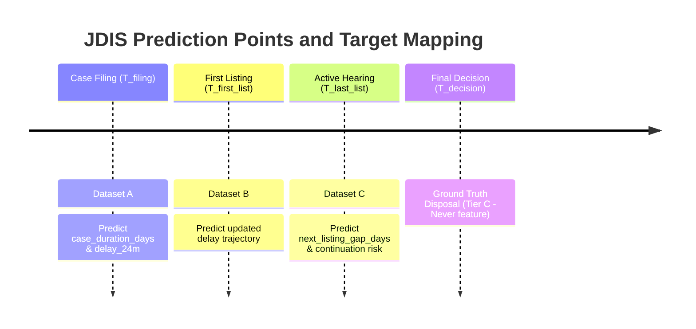

# JDIS ML-Ready Dataset Handoff Specification & Protocol

**From**: Tanmay — Data Engineer & Data Architect  
**To**: Gaurav — AI & Research Lead  
**Cc**: Namdeo (Backend Lead), Shukla (Frontend Lead)  
**Version**: 2.0.0 (Approved ML Release Candidate)  
**Date**: August 2026  
**Status**: Feature Engineering Complete — Handoff Ready  

---

## 1. Executive Summary & Final Deliverable Datasets

The complete data foundation for JDIS has been engineered, validated, and exported to `data/features/`. All datasets are stored in column-oriented **Apache Parquet format** with Snappy compression and strict type definitions.

| Dataset Name | File Path | Shape | Size | Prediction Point & Purpose |
| :--- | :--- | :--- | :--- | :--- |
| **Dataset A** | `data/features/filing_features.parquet` | (449,267, 87) | ~45.2 MB | **Filing Stage ($T_{\text{filing}}$)**: Duration regression & 24M delay classification using Tier A features only |
| **Dataset B** | `data/features/ongoing_features.parquet` | (449,267, 88) | ~45.8 MB | **First Listing Stage**: Ongoing case progression model using Tier A + initial hearing gap |
| **Dataset C** | `data/features/hearing_features.parquet` | (449,267, 19) | ~12.1 MB | **Active Hearing Stage ($T_{\text{last\_list}}$)**: Predicts `next_listing_gap_days` and hearing continuation risk |
| **Clean Master** | `data/processed/cases_clean.parquet` | (449,267, 40) | ~13.9 MB | Full normalized base relational table |
| **TF-IDF Model** | `data/features/tfidf_vectorizer.joblib` | 5,000 vocab | ~1.2 MB | Pretrained on Train cohort (2010–2016) |
| **SVD Model** | `data/features/tfidf_svd_model.joblib` | 50 dims | ~2.1 MB | Pretrained on Train cohort (2010–2016) |

---

## 2. Exact Target Definitions & Prediction Points



| Target Column | Modeling Task | Prediction Point | Mathematical Formula | Valid Record Filter |
| :--- | :--- | :--- | :--- | :--- |
| `case_duration_days` | Duration Regression | Filing ($T_{\text{filing}}$) | `(date_of_decision - date_of_filing).days` | `case_duration_days.notna()` ($N=369,498$) |
| `delay_24m` | Primary Delay Classification | Filing ($T_{\text{filing}}$) | $\mathbb{I}(\text{duration} > 730.5\text{ days})$ | `case_duration_days.notna()` (27.89% positive) |
| `delay_12m` | Sensitivity Classification | Filing ($T_{\text{filing}}$) | $\mathbb{I}(\text{duration} > 365.25\text{ days})$ | `case_duration_days.notna()` (46.76% positive) |
| `delay_36m` | Sensitivity Classification | Filing ($T_{\text{filing}}$) | $\mathbb{I}(\text{duration} > 1095.75\text{ days})$ | `case_duration_days.notna()` (16.59% positive) |
| `next_listing_gap_days` | Scheduling Latency Regression | Last Hearing ($T_{\text{last\_list}}$) | `(date_next_list - date_last_list).days` | `next_listing_gap_days.notna()` |
| `hearing_continuation_risk` | Continuation Risk Classification | Last Hearing ($T_{\text{last\_list}}$) | $\mathbb{I}(\text{hearing\_span\_days} > 365.25\text{ days})$ | `hearing_continuation_risk.notna()` |

---

## 3. Strict Temporal Split Protocol

To ensure zero look-ahead contamination, **random train-test splits are strictly prohibited.** Gaurav must partition datasets by `filing_year`:

```python
# Temporal Partitioning Strategy
train_df = df[df["filing_year"] <= 2016]  # 2010–2016 Cohort (~77% of corpus)
val_df   = df[df["filing_year"] == 2017]  # 2017 Cohort (~11% of corpus) - Tuning/Thresholding
test_df  = df[df["filing_year"] == 2018]  # 2018 Cohort (~12% of corpus) - Final IEEE Evaluation
```

---

## 4. Exact Input Feature Catalog (Dataset A: Filing Model)

### 4.1 Geographic, Bench & Calendar Features
- `state_code`, `dist_code`, `court_no` (Categorical integers / strings)
- `state_str`, `district_str`, `court_str` (Categorical names)
- `filing_year`, `filing_month`, `filing_day_of_week`, `filing_quarter` (Numerical calendar integers)
- `judge_position_clean` (Standardized categorical: `chief_judicial_magistrate`, `district_and_sessions`, etc.)
- `ddl_filing_judge_id` (Unique judge ID, float/int)
- `judge_gender` (Categorical: `0 nonfemale`, `1 female`, `UNCLEAR`)

### 4.2 Case Category & Statutory Law Features
- `type_name` (Case type integer ID) & `case_type_str` (Case type name)
- `case_category` (4-category string: `High-Confidence Criminal`, `High-Confidence Civil`, `Other/Unknown/Unclassified`, `Ambiguous/Mixed`)
- `is_criminal_code` (Numeric encoded: `1` = Criminal, `0` = Civil, `-1` = Unknown/Ambiguous)
- `statutory_act_count` (Integer: count of unique Acts attached to case)
- `ipc_section_count` (Integer: count of IPC sections charged)
- `bailable_ipc_flag` (Categorical flag: `1` = Bailable, `0` = Non-Bailable, `-1` = Non-IPC)
- `primary_act_id` (Dominant legal Act ID)

### 4.3 Demographics
- `female_defendant_clean` (Categorical: `MALE`, `FEMALE`, `UNCLEAR`, `MISSING`)
- `female_petitioner_clean` (Categorical: `MALE`, `FEMALE`, `UNCLEAR`, `MISSING`)
- `female_adv_def_clean` (Integer: `0`, `1`, `-2` unclear, `-1` missing)
- `female_adv_pet_clean` (Integer: `0`, `1`, `-2` unclear, `-1` missing)

### 4.4 Time-Safe Historical Context Features (Chronological Window)
- `court_prior_delay_rate` (Float $[0.0, 1.0]$: Smoothed delay rate of court strictly before $T_{\text{filing}}$)
- `court_prior_avg_duration` (Float: Historical average duration in days before $T_{\text{filing}}$)
- `court_prior_active_backlog` (Integer: Active unresolved filings in court at $T_{\text{filing}}$)
- `casetype_prior_delay_rate` (Float $[0.0, 1.0]$: Historical delay rate for this case type)

### 4.5 Graph Mobility Features
- `judge_court_degree` (Integer: Count of distinct courtrooms judge has presided over)
- `judge_tenure_days` (Float: Cumulative prior career tenure days of judge)
- `court_judge_turnover_count` (Integer: Count of distinct judges assigned to court)

### 4.6 NLP Text Components
- `tfidf_0` through `tfidf_49` (50 dense TruncatedSVD components from composite legal metadata)

---

## 5. Strict Prohibited Leakage Exclusions

Gaurav must ensure that the following columns are **NEVER PASSED AS MODEL INPUTS**:
- `date_of_decision` / `date_of_decision_dt`
- `disp_name` / `disp_str` / `disp_name_s`
- `ddl_decision_judge_id`
- `date_next_list` (in Dataset C)
- All target columns (`case_duration_days`, `delay_24m`, `delay_12m`, `delay_36m`)

---

## 6. Ready-to-Use Loading Code for Gaurav

```python
import pandas as pd
import numpy as np

def load_filing_experiment_data(path="data/features/filing_features.parquet"):
    """
    Standard loader for Filing-Time Duration and Delay Classification experiments.
    """
    df = pd.read_parquet(path)
    
    # 1. Filter resolved cases for supervised training
    resolved_df = df[df["case_duration_days"].notna() & (df["case_duration_days"] >= 0)].copy()
    
    # 2. Strict Temporal Split
    train_df = resolved_df[resolved_df["filing_year"] <= 2016]
    val_df   = resolved_df[resolved_df["filing_year"] == 2017]
    test_df  = resolved_df[resolved_df["filing_year"] == 2018]
    
    # 3. Identify Feature Columns (Exclude Identifiers & Targets)
    target_cols = ["case_duration_days", "delay_24m", "delay_12m", "delay_36m"]
    id_cols = ["ddl_case_id", "filing_year"]
    feature_cols = [c for c in train_df.columns if c not in target_cols + id_cols]
    
    X_train = train_df[feature_cols]
    y_train_reg, y_train_clf = train_df["case_duration_days"], train_df["delay_24m"]
    
    X_val = val_df[feature_cols]
    y_val_reg, y_val_clf = val_df["case_duration_days"], val_df["delay_24m"]
    
    X_test = test_df[feature_cols]
    y_test_reg, y_test_clf = test_df["case_duration_days"], test_df["delay_24m"]
    
    print(f"JDIS Filing Dataset Loaded Successfully:")
    print(f"  Training Set   (2010-2016): {X_train.shape[0]:,} cases | Features: {X_train.shape[1]} | Delay Rate: {y_train_clf.mean():.2%}")
    print(f"  Validation Set (2017):      {X_val.shape[0]:,} cases | Features: {X_val.shape[1]} | Delay Rate: {y_val_clf.mean():.2%}")
    print(f"  Test Set       (2018):      {X_test.shape[0]:,} cases | Features: {X_test.shape[1]} | Delay Rate: {y_test_clf.mean():.2%}")
    
    return (X_train, y_train_reg, y_train_clf), (X_val, y_val_reg, y_val_clf), (X_test, y_test_reg, y_test_clf)

if __name__ == '__main__':
    load_filing_experiment_data()
```

---

## 7. Next Steps & Handoff Sign-Off

The data foundation is **100% complete, reproducible, and tested**. 

In accordance with **Stop Condition 7 of the Master Instructions**, the Data Engineering workstream is now paused awaiting final team review.
